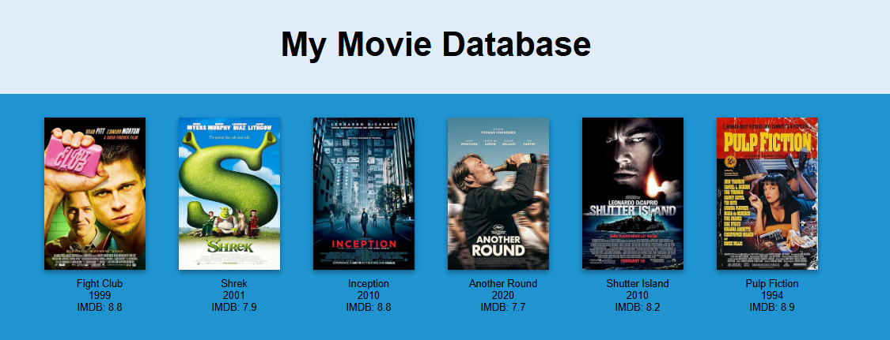

# Movie Project
> Access and write movie data

## Table of Contents
* [General Info](#general-information)
* [Technologies Used](#technologies-used)
* [Features](#features)
* [Screenshots](#screenshots)
* [Setup](#setup)
* [Usage](#usage)
* [Project Status](#project-status)
* [Room for Improvement](#room-for-improvement)


## General Information
- Simple CLI which allows you to interact with a JSON or CSV file and shows information about them in your console.


## Technologies Used
- Programming Language: Python
- Libraries: requests
- API: OMDB


## Features
List the ready features here:
- Add movie
- Delete movie
- Filter movie
- Movie stats
- Get a random movie
- Search movie
- Movies sorted by rating
- Movies sorted by year
- List all movies
- Add note to movie
- Generate a Website


## Screenshots

<!-- If you have screenshots you'd like to share, include them here. -->


## Setup
1. Clone this repository:
   ```bash
   git clone https://github.com/kayeffemm/Movie-Project.git
   cd Movie-Project
   ```

2. Install the required dependencies:
   ```bash
   pip install -r requirements.txt
   ```
3. Get your own OMDB API key [here](https://www.omdbapi.com/apikey.aspx) and create a .env file in the root folder.
   ```bash
   API_KEY='yourapikey'
   ```
4. Run the project (also possible to put argument after with your username:
   ```bash
   python main.py username.csv
   python main.py username.json
   ```


## Usage
After you start the program a menu pops up which prompts you to enter a number.


## Project Status
Project is: _in progress_


## Room for Improvement
Include areas you believe need improvement / could be improved. Also add TODOs for future development.

Room for improvement:
- Better CSS

To do:
- Add IMDB links to webpage
- Show county flag next to movie


